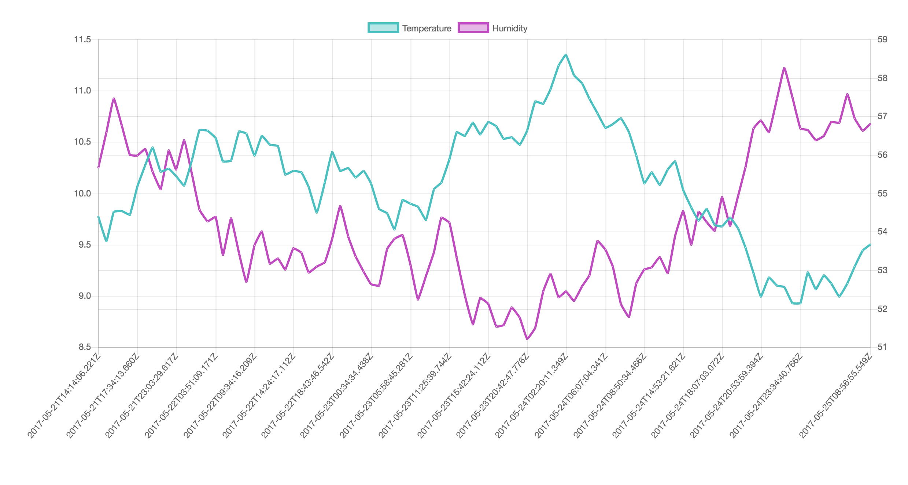

# A wine storage temperature and humidity logger

You can automatically setup the dev environment, which will spin up a cassandra db and insert randomly generated temperature data.

All you have to do is clone the repository and run

```sh
$ ./initialize
```

This initalization script will:
1. spin up the following services using `docker-compose`
  - a cassandra db
  - a simple API with a get route to get data from the C\*
  - a React App using chart.js to visualize the data
2. run a script to setup the keyspace and table in the C\*
3. run a script to generate random temp & humidity data and insert it in the C\*

**You can now navigate to the url displayed in the console and should see something similar to this:**



## Starting the setup a second time
Simply run `docker-compose build && docker-compose up`. You do not have to re-setup the db each time. Only if you ever do a `docker-compsoe down`. Then you will have to run `$ ./initialize` again.

## System requirements:
You must be able to run `docker-compose` commands and `sh` scripts. Everything else (including node stuff) will happen inside the containers and not affect your macheine.

### What about hot-reloading?
The react app uses the setup from `create-react-app` and thus has pretty advanced hot-reloading and error reporting for a great DX. This is not lost due to the dockerization. The `src` folder inside the `./frontend` app is linked using a docker volume. Therefore, hot-reloading still works. 

The only downside is that you have to rebuild the `frontend` service if you add another npm module, but I'm sure that could be automated as well. You could definitely link the node\_modules as a volume to the container, as well...

### Why are you running a dev build and not a prod build inside the docker-compose
The docker-compse config is meant as a easy-to-use dev environment. It is not meant as a pre-prod or even production environment.
